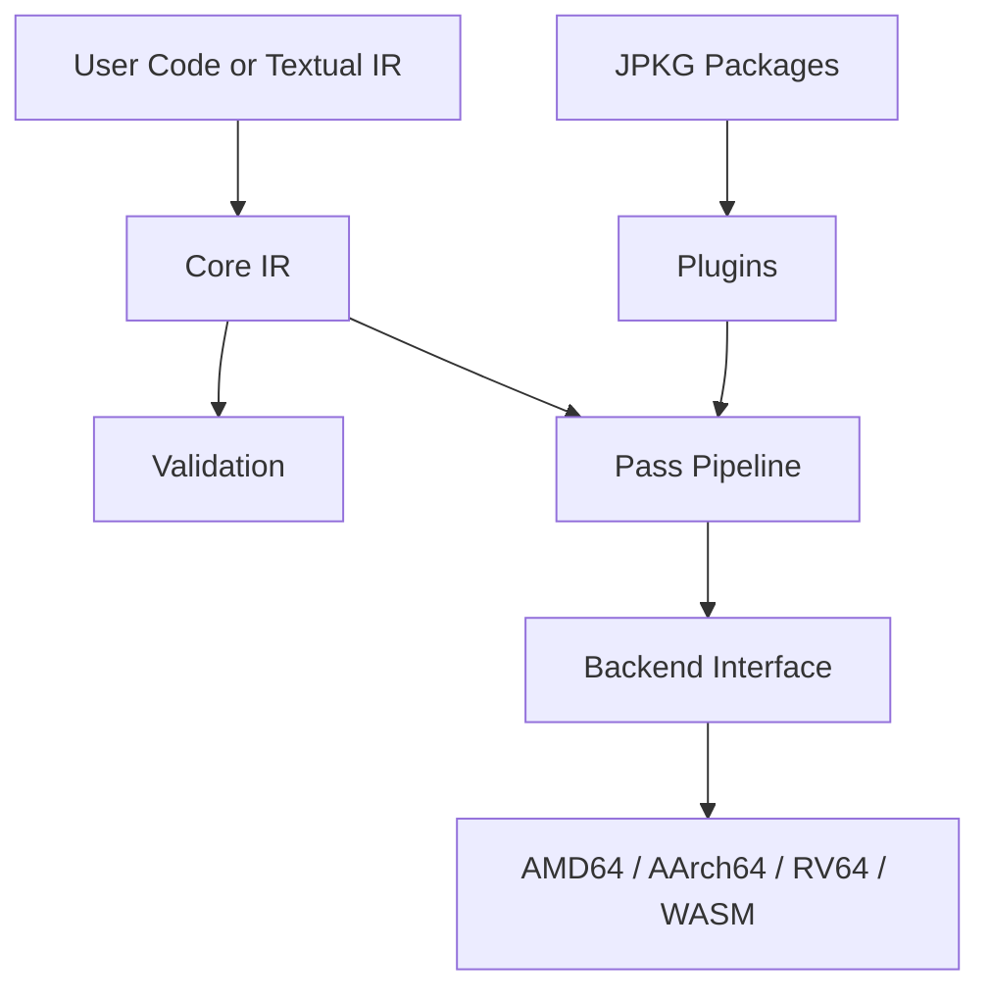

# Jiterati

Jiterati is a compact C++17 compiler and JIT experimentation toolkit with an in-memory IR, textual IR support, reusable optimization passes, target backends, plugins, optional Lua macros, and a package format for distributing extensions.

## Features

- C++ IR construction through `include/Jiterati.hpp`.
- Terse expression and TAC-style IR support in `IR/IR.hpp`.
- Pass infrastructure for analyses and transformations.
- Backends for AMD64, AArch64, RV64, and WebAssembly.
- Plugin and package specifications for extension distribution.
- Optional Lua macro bridge through `include/Jiterati-Macro.hpp` and `Lua/JiteratiBinding.cpp`.

## Architecture



## Quick Example

```cpp
#include <Jiterati.hpp>
using namespace jiterati;

Module module("demo");
auto int32 = Type::i32();
// Add functions, build IR, validate, optimize, and compile with a backend.
```

## Installation

Configure and build with CMake:

```bash
cmake -S . -B build
cmake --build build
ctest --test-dir build
```

Build documentation when Doxygen is available:

```bash
cmake --build build --target docs
```

## Manual

- [Introduction](manual/01-introduction.md)
- [Architecture](manual/02-architecture.md)
- [Core Concepts](manual/03-core-concepts.md)
- [The IR](manual/04-the-ir.md)
- [Parsing](manual/05-parsing.md)
- [Serialization](manual/06-serialization.md)
- [Validation](manual/07-validation.md)
- [Analysis Passes](manual/08-analysis-passes.md)
- [Transformation Passes](manual/09-transformation-passes.md)
- [Backend Interface](manual/10-backend-interface.md)
- [Writing a Backend](manual/11-writing-a-backend.md)
- [Plugin System](manual/12-plugin-system.md)
- [Writing Plugins](manual/13-writing-plugins.md)
- [Writing Passes](manual/14-writing-passes.md)
- [Package System](manual/15-package-system.md)
- [CLI](manual/16-cli.md)
- [Embedding Jiterati](manual/17-embedding-jiterati.md)
- [Internal Design](manual/18-internal-design.md)
- [`ljiterati` Lua Library](manual/19-ljiterati-library.md)
- [Macros](manual/20-macros.md)

## API Documentation

- `include/Jiterati.hpp`
- `include/Jiterati-BE.hpp`
- `include/Jiterati-Pass.hpp`
- `include/Jiterati-Plugin.hpp`
- `include/Jiterati-Macro.hpp`
- `IR/IR.hpp`

## Specifications

- `specs/IR.md`
- `specs/IR.ebnf`
- `specs/plugin-specs.yaml`
- `specs/passes-specs.yaml`
- `specs/backend-specs.yaml`
