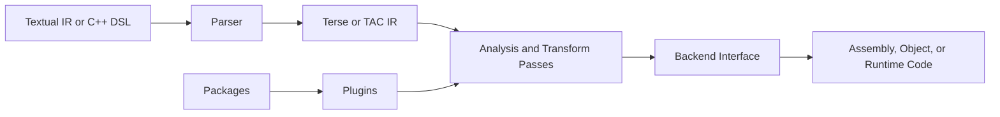

# Chapter 17: Embedding Jiterati

This chapter explains using the C++ API, macros, Lua, runtime ownership, and JIT boundaries. It is written for compiler engineers who already understand SSA, lowering, ABI boundaries, and pass pipelines, but who need a reliable map of Jiterati terminology and conventions.

## Position In The System

Jiterati is organized around a small C++ runtime, a textual and in-memory IR, reusable pass libraries, target backends, optional Lua-powered macros, and loadable plugins.
The public API is intentionally compact: users construct modules and functions, validate or transform them, and hand them to a backend or embedding host.
The implementation should keep architectural facts in datasets when possible, leaving C++ code to enforce algorithms and target-specific behavior.



The diagram is deliberately high-level. Individual backends may split lowering into instruction selection, register allocation, rewriting, peephole cleanup, and emission.

## Practical Example

```cpp
#include <Jiterati.hpp>

using namespace jiterati;

Module module("manual_example");
auto& fn = module.add_function("add_i32", Type::i32(), {Type::i32(), Type::i32()});
// Build IR with the fluent API, run validation, then pass it to a backend.
```

This example is schematic: exact builder calls should follow the current public API in `include/Jiterati.hpp` and the IR model in `IR/IR.hpp`.

## Engineering Notes
- Prefer deterministic output over incidental container iteration order.
- Treat diagnostics as part of the user interface and regression-test them when possible.
- Avoid target facts in generic code unless the fact is truly target-independent.
- Keep ownership explicit; public handles should not require callers to reason about hidden lifetimes.
- Separate analysis from mutation so pass preservation is meaningful.
- Cross-platform behavior is required; avoid platform-only assumptions in public APIs.
- If a behavior is not implemented yet, document the intended contract rather than reverse-engineering accidental behavior.
- Use the architecture datasets under `.agents/datasets/` as the source of truth for backend metadata.

## Detailed Guidance

### IR construction checkpoint 1
- In the context of embedding jiterati, define the boundary between generic Jiterati behavior and extension-specific behavior before adding new code.
- For IR construction, prefer a narrow contract that can be validated by tests, documentation examples, or specification examples.
- Record assumptions in the relevant specification when implementation details would otherwise become tribal knowledge.
- Keep examples small enough to audit, but complete enough to show names, types, operands, and expected diagnostics.
- When behavior touches a backend, compare the implementation against the matching dataset before changing tables by hand.

### validation checkpoint 1
- In the context of embedding jiterati, define the boundary between generic Jiterati behavior and extension-specific behavior before adding new code.
- For validation, prefer a narrow contract that can be validated by tests, documentation examples, or specification examples.
- Record assumptions in the relevant specification when implementation details would otherwise become tribal knowledge.
- Keep examples small enough to audit, but complete enough to show names, types, operands, and expected diagnostics.
- When behavior touches a backend, compare the implementation against the matching dataset before changing tables by hand.

### diagnostics checkpoint 1
- In the context of embedding jiterati, define the boundary between generic Jiterati behavior and extension-specific behavior before adding new code.
- For diagnostics, prefer a narrow contract that can be validated by tests, documentation examples, or specification examples.
- Record assumptions in the relevant specification when implementation details would otherwise become tribal knowledge.
- Keep examples small enough to audit, but complete enough to show names, types, operands, and expected diagnostics.
- When behavior touches a backend, compare the implementation against the matching dataset before changing tables by hand.

### pass interaction checkpoint 1
- In the context of embedding jiterati, define the boundary between generic Jiterati behavior and extension-specific behavior before adding new code.
- For pass interaction, prefer a narrow contract that can be validated by tests, documentation examples, or specification examples.
- Record assumptions in the relevant specification when implementation details would otherwise become tribal knowledge.
- Keep examples small enough to audit, but complete enough to show names, types, operands, and expected diagnostics.
- When behavior touches a backend, compare the implementation against the matching dataset before changing tables by hand.

### backend lowering checkpoint 1
- In the context of embedding jiterati, define the boundary between generic Jiterati behavior and extension-specific behavior before adding new code.
- For backend lowering, prefer a narrow contract that can be validated by tests, documentation examples, or specification examples.
- Record assumptions in the relevant specification when implementation details would otherwise become tribal knowledge.
- Keep examples small enough to audit, but complete enough to show names, types, operands, and expected diagnostics.
- When behavior touches a backend, compare the implementation against the matching dataset before changing tables by hand.

### serialization checkpoint 1
- In the context of embedding jiterati, define the boundary between generic Jiterati behavior and extension-specific behavior before adding new code.
- For serialization, prefer a narrow contract that can be validated by tests, documentation examples, or specification examples.
- Record assumptions in the relevant specification when implementation details would otherwise become tribal knowledge.
- Keep examples small enough to audit, but complete enough to show names, types, operands, and expected diagnostics.
- When behavior touches a backend, compare the implementation against the matching dataset before changing tables by hand.

### testing checkpoint 1
- In the context of embedding jiterati, define the boundary between generic Jiterati behavior and extension-specific behavior before adding new code.
- For testing, prefer a narrow contract that can be validated by tests, documentation examples, or specification examples.
- Record assumptions in the relevant specification when implementation details would otherwise become tribal knowledge.
- Keep examples small enough to audit, but complete enough to show names, types, operands, and expected diagnostics.
- When behavior touches a backend, compare the implementation against the matching dataset before changing tables by hand.

### documentation checkpoint 1
- In the context of embedding jiterati, define the boundary between generic Jiterati behavior and extension-specific behavior before adding new code.
- For documentation, prefer a narrow contract that can be validated by tests, documentation examples, or specification examples.
- Record assumptions in the relevant specification when implementation details would otherwise become tribal knowledge.
- Keep examples small enough to audit, but complete enough to show names, types, operands, and expected diagnostics.
- When behavior touches a backend, compare the implementation against the matching dataset before changing tables by hand.

### packaging checkpoint 1
- In the context of embedding jiterati, define the boundary between generic Jiterati behavior and extension-specific behavior before adding new code.
- For packaging, prefer a narrow contract that can be validated by tests, documentation examples, or specification examples.
- Record assumptions in the relevant specification when implementation details would otherwise become tribal knowledge.
- Keep examples small enough to audit, but complete enough to show names, types, operands, and expected diagnostics.
- When behavior touches a backend, compare the implementation against the matching dataset before changing tables by hand.

### embedding checkpoint 1
- In the context of embedding jiterati, define the boundary between generic Jiterati behavior and extension-specific behavior before adding new code.
- For embedding, prefer a narrow contract that can be validated by tests, documentation examples, or specification examples.
- Record assumptions in the relevant specification when implementation details would otherwise become tribal knowledge.
- Keep examples small enough to audit, but complete enough to show names, types, operands, and expected diagnostics.
- When behavior touches a backend, compare the implementation against the matching dataset before changing tables by hand.

### IR construction checkpoint 2
- In the context of embedding jiterati, define the boundary between generic Jiterati behavior and extension-specific behavior before adding new code.
- For IR construction, prefer a narrow contract that can be validated by tests, documentation examples, or specification examples.
- Record assumptions in the relevant specification when implementation details would otherwise become tribal knowledge.
- Keep examples small enough to audit, but complete enough to show names, types, operands, and expected diagnostics.
- When behavior touches a backend, compare the implementation against the matching dataset before changing tables by hand.

### validation checkpoint 2
- In the context of embedding jiterati, define the boundary between generic Jiterati behavior and extension-specific behavior before adding new code.
- For validation, prefer a narrow contract that can be validated by tests, documentation examples, or specification examples.
- Record assumptions in the relevant specification when implementation details would otherwise become tribal knowledge.
- Keep examples small enough to audit, but complete enough to show names, types, operands, and expected diagnostics.
- When behavior touches a backend, compare the implementation against the matching dataset before changing tables by hand.

## Common Failure Modes

- A pass silently mutates CFG shape while claiming to preserve CFG analyses.
- A backend accepts an operand form that the dataset does not describe.
- A serializer emits nondeterministic order and breaks reproducible package builds.
- A plugin relies on process-global state without documenting initialization and shutdown ordering.
- A diagnostic reports a generic failure where a source location and actionable suggestion are available.

## Summary

- Embedding Jiterati should be understood as part of the larger Jiterati contract, not as an isolated implementation detail.
- Specifications describe behavior; source files implement the current strategy for that behavior.
- Compiler-facing documentation should favor exact invariants, failure cases, and extension points.

## Further Reading

- `specs/IR.md` for the behavioral IR reference.
- `specs/IR.ebnf` for the textual grammar.
- `specs/backend-specs.yaml` for target contracts.
- `specs/plugin-specs.yaml` and `specs/passes-specs.yaml` for extension metadata.

## Related APIs

- `include/Jiterati.hpp`
- `include/Jiterati-BE.hpp`
- `include/Jiterati-Pass.hpp`
- `include/Jiterati-Plugin.hpp`
- `include/Jiterati-Macro.hpp`
- `IR/IR.hpp`
